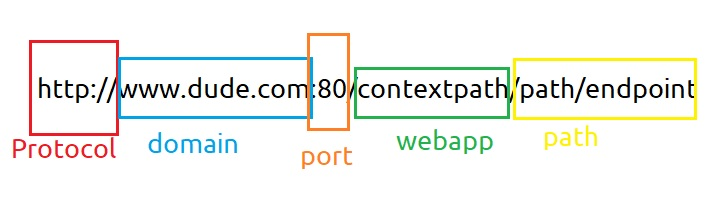
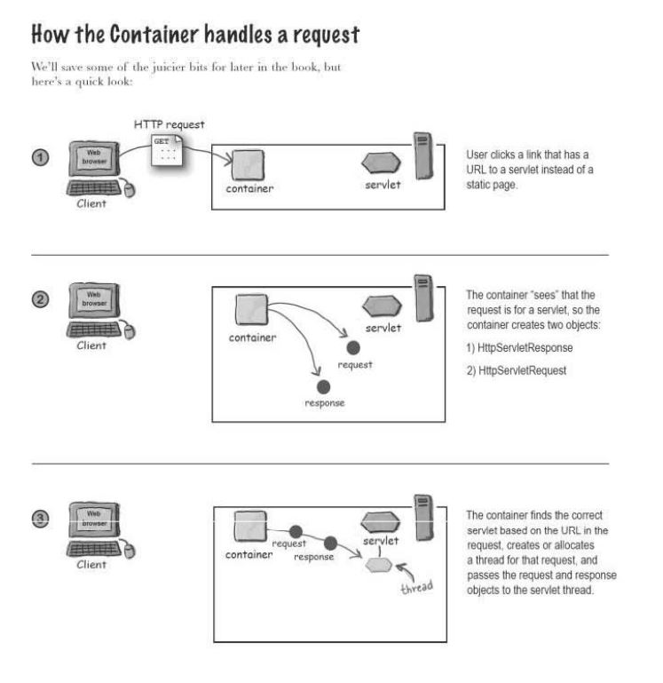
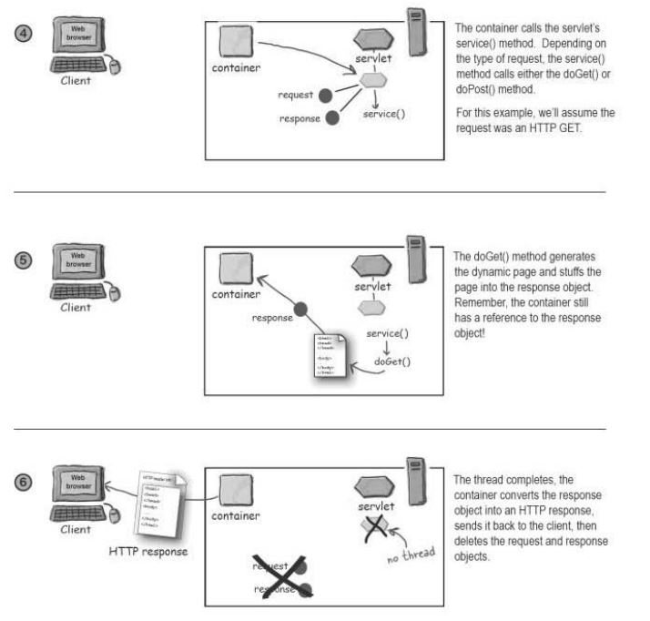

## What does your web sever do?

A web browser lets a user request a resource. The web server gets the request, finds the resource, and returns something to the user.


When browser gets html page(`Content-Type: text/html` in response header), it will render as html page.

## What is Apache Tomcat?

There are 2 pieces in server:
1. Web Server
2. App Server

Apache is an example of Web server and Tomcat is an example of App Server. Web Server serves static content and App Server serves dynamic content.

## Types of Request(GET, POST)

Request and Response contains three things:
1. URL (with query parameters) to where it is pointing.
2. Request Headers.
3. Request Body(not present in GET).

GET is a simple request, POST can send user data.

HTTP 1.1 had only two types of methods, rest like PUT, DELETE, TRACE, etc were added in HTTP 2.

Type of request is identified by a request header called `method`.

POST has body enclosed but GET does not and if you want to send data with GET, you can do that by appending query parameters.


## URL



Port 80 is reserved for http so if you dont specify any port it will take 80. HTTPS runs on 443.

## Directory Structure


Well, this for Apache, however, for Apache tomcat, you will see a directory named `webapps`.

## Simple Servlet Application

So, there will be 2 folders, one for development and another for deployment:

Development Structure should be as follows:
- project_1 > src
- project_1 > classes
- project_1 > etc

1. Step 1
etc/web.xml
```xml
<?xml version="1.0" encoding="ISO-8859-1"?>
<web-app xmlns="http://java.sun.com/xml/ns/j2ee"
    xmlns:xsi="http://www.w3.org/2001/XMLSchema-instance"
    xsi:schemaLocation="http://java.sun.com/xml/ns/j2ee http://java.sun.com/xml/ns/j2ee/web-app_2_4.xsd"
    version="2.4">

  <servlet>
    <servlet-name>Chapter 1 Select</servlet-name>
    <servlet-class>com.ch1.Ch1Servlet</servlet-class>
  </servlet>

  <servlet-mapping>
    <servlet-name>Chapter 1 Select</servlet-name>
    <url-pattern>/serv1</url-pattern>
  </servlet-mapping>
</web-app>    
```

Make sure you create `com/ch1` folder for package hierarchy.

src/Ch1Servlet.java
```java
package com.ch1;

import javax.servlet.*;
import javax.servlet.http.*;
import java.io.*;
import java.time.*;

public class Ch1Servlet extends HttpServlet {

    public void doGet(HttpServletRequest request, HttpServletResponse response) throws IOException {
        PrintWriter out = response.getWriter();
        LocalDate today = LocalDate.now(ZoneId.of("GMT+05:30"));

        out.println("<html><body><h1>"+today+"</h1></body></html>");
    }
}
```

2. Step 2
Run this command in `project_1` folder:
```sh
javac -cp C:\apache-tomcat-8.5.66\lib\servlet-api.jar -d classes src/Ch1Servlet.java
```

3. Step 3
 1. Create `project_1` folder in `webapps`
 2. Create `WEB-INF` folder in `project_1`
 3. Create `classes` folder in `WEB-INF`

4. Step 4
 1. Copy folder inside `classes` to `project_1/WEB-INF/`
 2. Copy `etc/web.xml` to `project_1/WEB-INF/`

5. Go to $CATALINA_HOME/bin from cmd and run `startup.bat`

6. Visit `http://localhost:8080/ch1/serv1`


## What is a Container?

Servlets dont have a `main()` method. They are under the control of another Java application called a Container. Tomcat is an example of a Container. When your web server gets a request for a servlet, the server hands the request not to the servlet itself, but to the Container in which the servlet is deployed. It's the Container that gives servlet the HTTP request and response, and its the Container that calls the servlet's methods(doPost(), doGet()).


## Container handling a request




## A servlet can have THREE names

A servlet has a file path name, like `classes/registeration/SignUpServlet.class`, another is deployment name which is simply a secret internal name that doesn't have to be the same as class or file name and last one is public URL name which client will refer to.

## MVC

It creates separation between middleware and view.
How your development environment will look:
```
project_1/src/
project_1/classes/
project_1/etc/
project_1/lib/
project_1/web/
```


